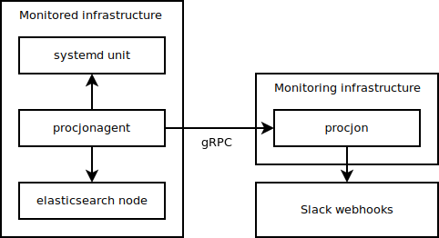

# procjon

[](https://goreportcard.com/report/github.com/PiotrKozimor/procjon)
[](https://codecov.io/gh/PiotrKozimor/procjon)
[](https://travis-ci.org/github/PiotrKozimor/procjon)
[](https://github.com/PiotrKozimor/procjon/blob/master/LICENSE)
[](https://pkg.go.dev/github.com/PiotrKozimor/procjon)
[](https://github.com/PiotrKozimor/procjon/releases)


Procjon is simple monitoring tool written in Go. It is a deamon which sends updates to Slack webhook when status of monitored service changes.
Service status is sent to procjon by procjonagent. 


<!--  -->

How does procjon work?
 - Service must be registered first. Service identifier, service timeout and array of Human redable statuses are sent.
 - Then, service is periodically pinged - only identifier and status index is sent.
 - After first ping, procjon sends service availability update to Slack, indicating that service is available. 
 - When status sent in ping changes, procjon sends service status update to Slack.
 - When status sent in first ping is non-zero, procjon sends service status update to Slack.


Important operating principle of procjon is that reliability of monitoring server is higher that infrastructure to monitor. Procjon was designed to deal with unreliable internal infrastructure and many processes which were set-up and then left forgotten (e.g. long term tests). HA is not yet planned. 

## Running procjon
To run procjon, certificates must be generated. See [script](.cert_gen.sh) used for testing purposes. Script will generate certificates to `.certs` directory. Having certificates, get binaries from [releases](releases) or install it using go:
```
$ go install github.com/PiotrKozimor/procjon/procjon
$ go install github.com/PiotrKozimor/procjon/procjonagent
```

Then run procjon (assuming certificates in `.certs` directory):
```
$ ./procjon -l debug
```
and procjonagent:
```
$ ./procjonagent ping -l debug
```
When you stop procjonagent, procjon will sent message to Slack after 10s (default timeout) that service foo is not available. 

## Procjonagent
Three procjonagents are implemented: `ping`, `elasticsearch` and `systemd`. Each agent is subcommand in `procjonagent`.

Each agent implements `Agenter` interface. Own agent can be easily implemented and integrated into existing application. Please see [example](example/main.go).

